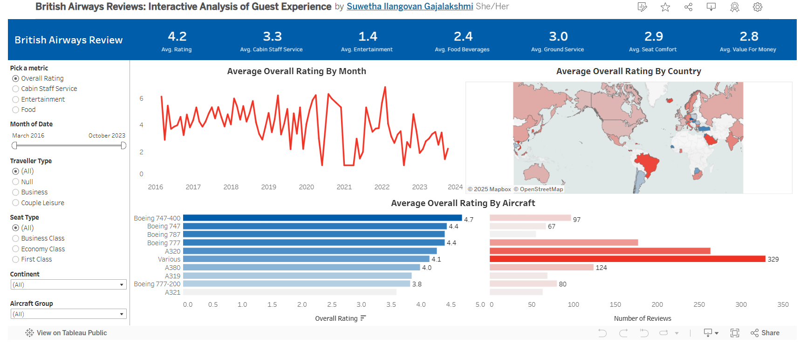
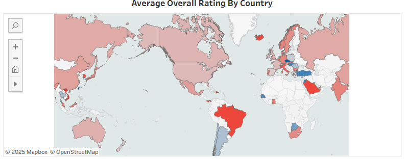
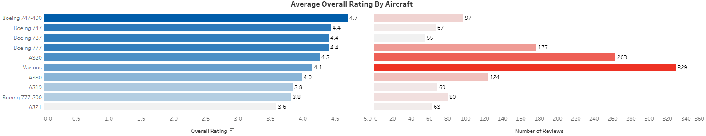

# **British Airways Reviews Tableau Dashboard**

This interactive dashboard visualizes customer reviews for British Airways. Users can explore key satisfaction metrics and uncover trends through its dynamic filters.

## **Dashboard Preview**
Here’s a snapshot of the dashboard:  

  
  
  
📌 *Filters and interactive visuals help users explore trends across different factors.*  

  

📌 *Map visualization showing average ratings by country.*  

  

📌 *Bar chart comparing overall ratings across different aircraft types.*  

## **Features**
- **Key Metrics**: Explore ratings for cabin staff service, food quality, entertainment, ground service, and seat comfort.
- **Dynamic Filters**: Easily filter by month, seat type, traveller type, aircraft, and continent.
- **Visual Insights**: Line charts, maps, and bar charts provide an in-depth look at customer satisfaction.

## **Live Dashboard**
You can interact with the full dashboard here:  
🔗 [British Airways Reviews Dashboard](https://public.tableau.com/views/BritishAirwaysReview_17202186412550/Dashboard)

## **Demo Video 🎥**
Watch a short demo of the interactive dashboard:  
📽️ [Dashboard Video](dashboard-demo.mp4)  

## **How to Use**
1. Visit the Tableau Public link above to explore the dashboard.
2. Use the interactive filters to analyze trends based on different factors.
3. Download the Tableau workbook (`.twb` or `.twbx`) from this repository to explore further.

