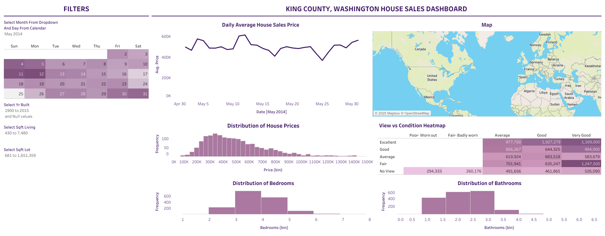

## **King County House Sales Dashboard**  

This interactive **Tableau dashboard** explores **housing trends** in King County, helping users analyze home prices, bedroom/bathroom distributions, and property conditions.  

### **Live Dashboard**
🔗 **[View the Dashboard](https://public.tableau.com/shared/YMGFGRY7W?:display_count=n&:origin=viz_share_link)**   

### **Features**
- **Calendar Widget** – Select specific time periods to analyze sales trends
- **Key Insights** – View price trends, property conditions, and housing distributions
- **6 Visualizations**:  
   - **Line Chart** – Average house price over time 
   - **Map** – Geographic distribution of average prices   
   - **Histograms** – House price distribution, bedroom distribution, bathroom distribution 
   - **Heatmap** – Relationship between property views and condition 

### **Dashboard Preview**
 

📌 *Use the calendar widget to filter sales trends dynamically!*  

  

📌 *Explore price variations across different locations in King County!*  

  

### **How to Use**
1. **Explore the Dashboard** – Click the link above to interact with the data.  
2. **Use Filters** – Adjust the calendar widget and filters to analyze trends.  
3. **Download** – Access the Tableau workbook (`.twb` or `.twbx`) for further exploration.  

---

#### **Meme Corner 😆**  
When house prices just keep rising... 📈🏡  

  

---

This project provides a **data-driven look into King County's housing market**, making real estate trends more accessible through visual storytelling.   

